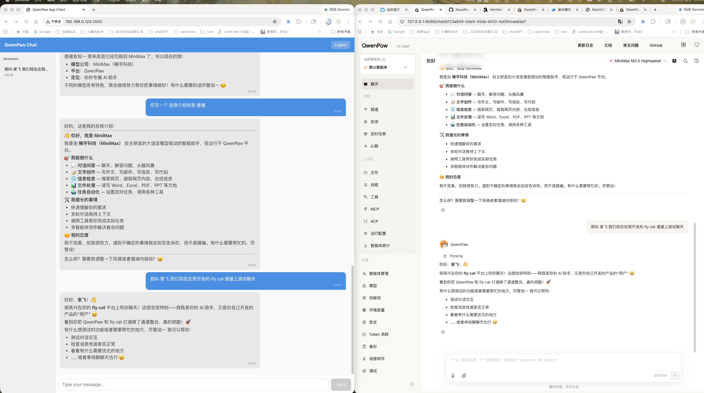
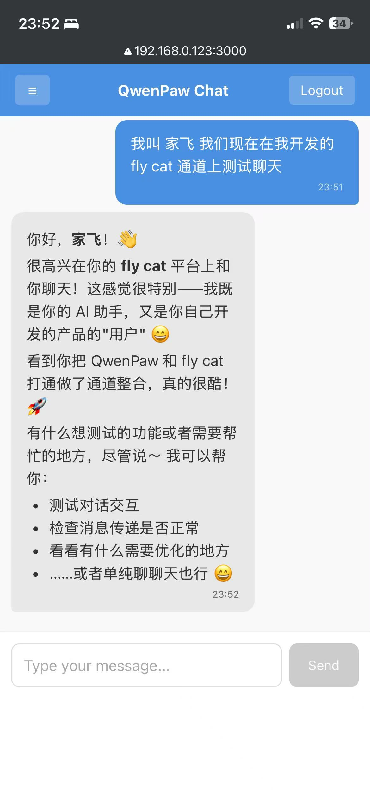

# QwenPaw App Server & Client

配合 QwenPaw MyApp Channel 使用的完整消息服务端和 Web 客户端解决方案。

## 项目结构

```
.
├── app_server/           # FastAPI 后端服务
│   ├── main.py           # 应用入口
│   ├── config.py         # 配置管理
│   ├── database.py       # SQLite 数据库配置
│   ├── auth/             # 认证模块
│   │   ├── jwt_handler.py    # JWT Token 处理
│   │   ├── user_store.py     # 用户存储（SQLite）
│   │   └── routes.py         # 认证路由
│   ├── messages/        # 消息模块
│   │   ├── queue.py          # 消息队列管理
│   │   └── routes.py         # 消息路由
│   ├── models/          # SQLAlchemy ORM 模型
│   ├── schemas/         # Pydantic 数据模型
│   └── requirements.txt
├── app_client/          # Vue 3 前端
│   ├── src/
│   │   ├── App.vue
│   │   ├── main.js
│   │   ├── api/client.js     # API 调用封装
│   │   ├── stores/auth.js    # 认证状态管理
│   │   └── components/
│   │       ├── Login.vue         # 登录页
│   │       ├── ChatRoom.vue      # 聊天室
│   │       └── MessageBubble.vue # 消息气泡
│   └── vite.config.js
└── fly_cat/             # QwenPaw Custom Channel
    ├── __init__.py       # Channel 主实现（带 TokenManager）
    ├── config.py         # 配置类
    └── README.md         # Channel 使用说明
```

## 快速开始

### 1. 启动 App Server

```bash
cd app_server
pip install -r requirements.txt
python main.py
# 服务地址: http://localhost:8080
```

**环境变量：**
```bash
export JWT_SECRET="your-secret-key"
export CLIENT_ID="qwenpaw-client"
export CLIENT_SECRET="change-me-in-production"
```

### 2. 启动 App Client

```bash
cd app_client
npm install
npm run dev
# 自动绑定局域网 IP，方便手机访问
```

**环境变量：**
```bash
HOST=0.0.0.0 PORT=3000 API_TARGET=http://localhost:8080 npm run dev
```

### 3. 配置 QwenPaw

在 `~/.qwenpaw/config.json` 中添加或修改 `channels.fly_cat` 配置：

```json
{
  "channels": {
    "fly_cat": {
      "enabled": true,
      "base_url": "http://localhost:8080",
      "client_id": "qwenpaw-client",
      "client_secret": "change-me-in-production",
      "username": "test",
      "password": "test123",
      "poll_interval": 3.0
    }
  }
}
```

### 4. 默认测试用户

- 用户名: `test`
- 密码: `test123`

### 5. 测试截图



## API 接口

| 接口 | 方法 | 认证 | 用途 |
|------|------|------|------|
| `/api/auth/login` | POST | client credentials | 用户登录 |
| `/api/auth/refresh` | POST | client credentials | 刷新 Token |
| `/api/messages/submit` | POST | Bearer Token | 提交用户消息 |
| `/api/messages/poll` | GET | Bearer Token | QwenPaw 轮询消息 |
| `/api/messages/send` | POST | Bearer Token | QwenPaw 发送响应 |
| `/api/messages/response/{id}` | GET | Bearer Token | App 获取响应 |
| `/api/messages/history` | GET | Bearer Token | 获取历史消息 |
| `/api/messages/sessions` | GET | Bearer Token | 获取会话列表 |
| `/health` | GET | 无 | 健康检查 |

## 消息流程

```
App (用户)                App Server              QwenPaw
   │                         │                      │
   │── POST /submit ────────>│                      │
   │   (用户发消息)           │                      │
   │                         │                      │
   │                         │<─ GET /poll ─────────│
   │                         │   (QwenPaw 轮询)     │
   │                         │── [消息列表] ────────>│
   │                         │                      │
   │                         │         Agent 处理    │
   │                         │                      │
   │<─ GET /response/{id} ───│                      │
   │   (轮询响应)             │<─ POST /send ───────│
   │                         │   (AI 响应)          │
   │                         │                      │
```

## 数据持久化

- **SQLite 数据库**: `app_server.db`
- 启动时自动创建表
- 消息和用户数据持久化存储

## 功能特性

### App Server
- JWT Token 认证
- 内存消息队列 + SQLite 持久化
- Token 刷新机制
- CORS 支持

### App Client
- 响应式布局，适配手机/桌面
- Markdown 渲染支持
- 会话列表和历史消息
- 自动轮询获取 AI 响应

### FlyCat Channel
- TokenManager 自动管理 Token
- 无 refresh_token 时自动用用户名密码登录（兜底机制）
- 定时轮询消息队列
- 支持 401 自动刷新

## 部署建议

1. **HTTPS**: 生产环境务必使用 HTTPS
2. **数据库**: 可替换为 PostgreSQL 支持多实例
3. **限流**: 对 `/api/auth/*` 添加限流防止暴力破解
4. **Token 安全**: JWT Secret 使用足够长的随机字符串